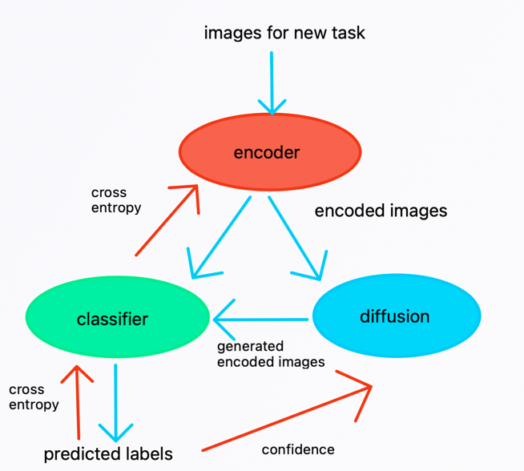

# Continual learning agent from scratch

The   goal   of   the   project   is   to   explore   and   understand   the   challenge   that
continual learning means to modern artificial learning agents. 

Humans are great at learning online, and utilize the previously acquired knowledge in novel   tasks,   which   is   not   the   case   for   artificial  agents.   
In   recent   years many   works   focused   on   understanding   the   nature   of   catastrophic forgetting or continual task learning.   
Our goal is to understand the architectural principles that can support solving continual learning tasks.

* Thus, we define a convolutional neural network from scratch and train it for general image classification.  
* Then we split the training data to different tasks, 
* and train the model on the tasks according to different training regimes (e.g. blocked and interleaved arethe two extremes and intermediate solutions also possible). 

The project aims to explore different techniques offered by the literature,
to   increase   performance   during   continual   learning.   
The   engineering principles that might lead to better performance could be freezing weights,
introducing memory, introducing replay (via a recurrent layer), introducing
inductive biases, applying meta-learning, and so on.

# Instructions to use
The main program which can be found in main.ipynb file is quite memory-intensive, and as such, it cannot be executed in its entirety without utilizing Google Colab Pro. However, within the Testing for Development section, there is a shorter demo consisting of two tasks which can be run on a GPU. To execute this demo, it is only necessary to run all the cells that come before it. The Testing for Development block also includes an evaluation section which assesses the program's performance on these two tasks. 
The final program will perform the same processes as the Testing for Development section but will include all tasks, which is expected to take a considerable amount of time.

continual-learning-ait
  *stable_diffusion
      *autoencoder_kl.py   #encoder and decoder models
      *constant.py         #constant for stable diffusion model
      *diffusion_model.py  #u-net diffusion model
      *layers.py           #padded_conv2d, helper functions
      *stable_diffusion.py #stable diffusion 
  *classifier.py            #classifier model
  *data_preparation.py      #function to load the datasets, split them into tasks
  *utils.py                 #additional utility functions
  *main.ipynb               #main file for the experiment
 
      

# The architecture
The architecture utilizes the Generative Replay based MIR(Maximally Interferred Retrival) idea and a modified Stable Diffusion model. (Planning to make changes on the Diffusion model loss function.)

# The team
Székely Anna,
Aryan Prabhudesai,
Freund László

